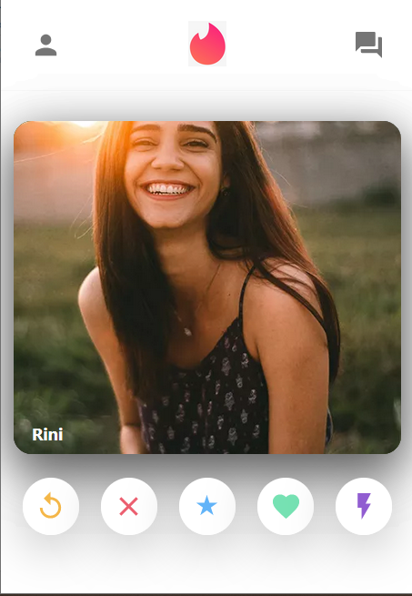

# TINDER-CLONE

 

### 1. [Key Features](#key-features) 
### 2. [Technologies I've used](#technologies-ive-used)
 

## Key Features:
    1. We can swipe the card image.
    
    2. Using the chat option we can start messaging with certain people.
    
  ### Build Showcase
  
  
  
  **[⬆ Back to Top](#tinder-clone)**

## Technologies I've used:
    1. react-tinder-card => to make the elements behave like card with swapable feature just like tinder.
    
    2. react => Entire front-end design of this app is made by Reactjs.
    
    3. react-router => to move through the different pages of this app.
    
    4. material-UI => I've used Material-UI to design this application.
        
    5. firebase => to deploy the app
    
    
  **[⬆ Back to Top](#tinder-clone)**
